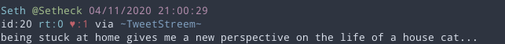

TweetStreem
---
A cross platform twitter client for the terminal. 
Inspired heavily by [rainbowstream](https://github.com/orakaro/rainbowstream)

### Installation
To install, download the release package (tweetstreem.tar.gz) from the [Releases](https://github.com/Setheck/tweetstreem/releases) page.
Upon first run, it will prompt for login and store your tokens and configurations in `$HOME/.tweetstreem.json` 

**Note** currently `.tweetstreem.json` stores your user token and secret (this is not username or password) in clear text, if you have security concerns with storing these twitter credentials in your home directory, you may want to avoid this application for now.
You can always revoke these tokens by going to [Twitter Applications](https://twitter.com/settings/applications) while logged in and revoking the `~TweetStreem~` application.

### Actions
* config - show the current configuration
* p,pause - pause the stream
* r,resume - resume the stream
* v,version - print tweetstreem version
* o,open - open the link in the selected tweet (optionally provide 0 based index)
* b,browse - open the selected tweet in a browser
* rt,retweet - retweet the selected tweet
* urt,unretweet - uretweet the selected tweet
* li,like - like the selected tweet
* ul,unlike - unlike the selected tweet
* reply <id> <status> - reply to the tweet id (requires user mention, and confirmation)
* cbreply <id> - reply to tweet id with clipboard contents (requires confirmation)
* t,tweet <status> - create a new tweet and post (requires confirmation)
* me - view your recent tweets
* home - view your default timeline
* q,quit,exit - exit tweetstreem.
* h,help - this help menu :D

### Configuration
Tweetstream will create `$HOME/.tweetstreem.json`
Example of default configuration
```
{
  "config": {
    "twitterConfiguration": {
      "pollTime": 120000000000,
      "userToken": "*****",
      "userSecret": "*****"
    },
    "tweetTemplate": "\n{{ .UserName | color \"cyan\" }} {{ \"@\" | color \"green\" }}{{ .ScreenName | color \"green\" }} {{ .RelativeTweetTime | color \"magenta\" }}\nid:{{ .Id }} {{ \"rt:\" | color \"cyan\" }}{{ .ReTweetCount | color \"cyan\" }} {{ \"♥:\" | color \"red\" }}{{ .FavoriteCount | color \"red\" }} via {{ .App | color \"blue\" }}\n{{ .TweetText }}\n",
    "templateOutputConfig": {
      "MentionHighlightColor": "blue",
      "HashtagHighlightColor": "magenta"
    },
    "enableApi": false,
    "apiPort": 8080,
    "autoHome": false
  }
}
```

### Templating
Output of tweets is based on go templates and some home grown helpers.
The default Template is:

```

{{ .UserName | color "cyan" }} {{ "@" | color "green" }}{{ .ScreenName | color "green" }} {{ .RelativeTweetTime | color "magenta" }}
id:{{ .Id }} {{ "rt:" | color "cyan" }}{{ .ReTweetCount | color "cyan" }} {{ "♥:" | color "red" }}{{ .FavoriteCount | color "red" }} via {{ .App | color "blue" }}
{{ .TweetText }}

  ```
which results in the following



Template Fields that exist are
* UserName          - The twitter user name who created the tweet
* ScreenName        - The twitter handle who created the tweet
* RelativeTweetTime - When the tweet occurred (ex: `1h37m19s ago` if < 24 hours ago, `03/25/2020 01:07:21` otherwise) 
* ReTweetCount      - # of retweets
* FavoriteCount     - # of favotires
* App               - Name of app that created the tweet
* TweetText         - Text of the tweet

Template Helpers that exist are
* `color <colorstr> <text to colorize>`

*Note Windows terminal does not support colors*

Available colors are 
* black
* red
* green
* yellow
* blue
* magenta
* cyan
* gray
* white

### Remote Commands
If the `apiEnabled` flag is true, tweetstream will start an rpc server and accept commands from client mode.
This feature mainly exists, so that you can control the tweetstreem output from another terminal session.


### Client Mode
If you have another tweetstream running in api mode, you can send remote commands
with the `-c` flag and your command.
ex:
```
$ tweetstreem -c home
``` 